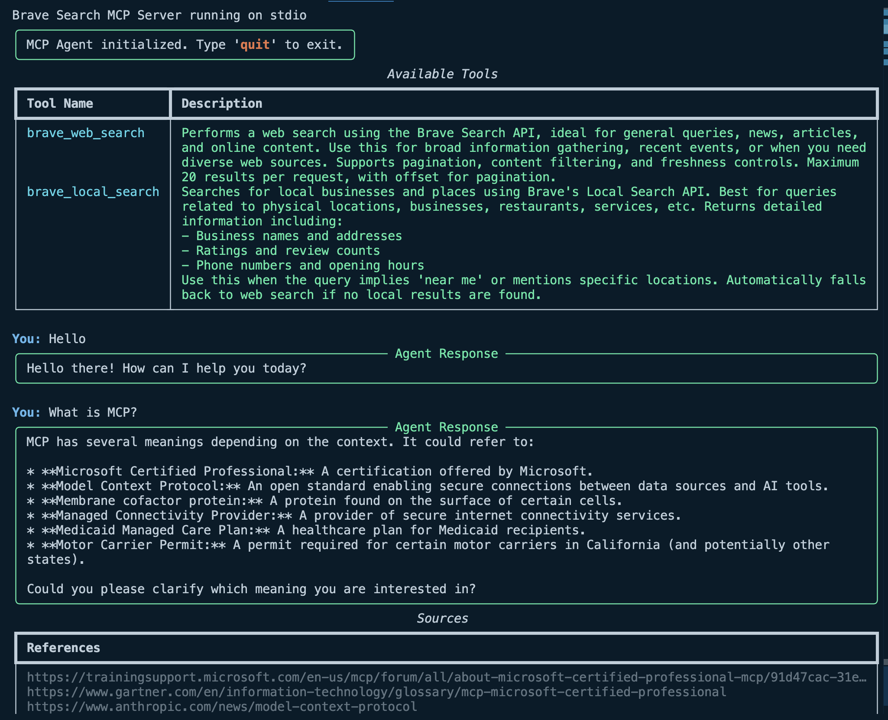

# Simple MCP Agent

A command-line agent that uses the Model Context Protocol (MCP) to access external tools and provide helpful responses.

## Overview



This agent connects to MCP-compatible servers, discovers available tools, and uses them to respond to user queries. It leverages the Opper SDK for AI-powered reasoning and response generation.

## Features

- Connects to MCP servers running in Docker containers
- Automatically discovers available tools from connected servers
- Uses AI to determine when and how to use tools based on user input
- Generates natural language responses incorporating tool results
- Provides source references when applicable
- Enhanced terminal output using Rich library

## Installation

1. Clone the repository
2. Install dependencies:
   ```bash
   pip install -r requirements.txt
   ```

## Configuration

### Adding MCP Servers

The agent can be configured with different MCP servers and tools by modifying the `server_configs` list in the code. Each server configuration requires:

- `image`: The Docker image name for the MCP server
- `env`: Environment variables needed by the server (e.g., API keys)

Example code has Brave Search as a tool.

### Brave Search MCP Server

Follow these steps to add Brave Search as a tool:

1. Clone the MCP server repository: https://github.com/modelcontextprotocol/
2. Run `docker build -t mcp/brave-search:latest -f src/brave-search/Dockerfile .`
3. Signup for a Brave Search API key: https://api-dashboard.search.brave.com/login
4. It's free but you need to add a credit card to your account
5. Add the API key to the `BRAVE_SEARCH_API_KEY`  variable in the code
6. Start the agent with the instructions below (it will run and execute the docker container)

### Opper API key

For Agent reasoning, example uses Opper API:

1. Signup for an Opper account: https://opper.com/ (it's free!)
2. Create an API key
3. Add the API key to the `OPPER_API_KEY` environment variable in the code

## Usage

Run the agent from the command line:

```
python cli.py
``` 

## Interacting with the Agent

Once running, you can interact with the agent through the command line:

1. Type your question or request
2. The agent will determine if tools are needed to answer
3. If tools are used, the agent will incorporate their results in the response
4. Source references will be displayed when available
5. Type 'quit', 'exit', or 'q' to end the session

## Project Structure

- `cli.py`: Command-line interface with Rich formatting
- `agent.py`: Core agent implementation
- `schemas.py`: Data models/schemas used by the application
- `requirements.txt`: Dependencies for the project

